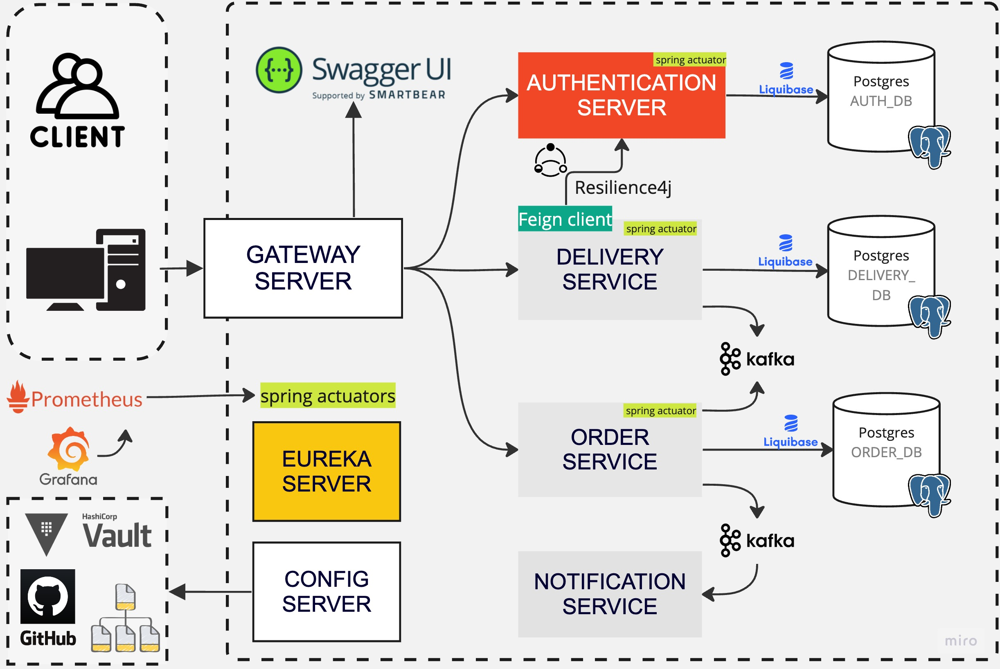

# Parcel Delivery APP
[](https://github.com/leonidrakitin/Parcel-Delivery-App/actions/workflows/ci-gradle-build.yml)


This is my implementation of the test task with the following assignment:

> You’ll be expected to build the back-end of the web app, while the front-end will be built by another
developer in the team.
To do this, you are expected to implement a solution that enables the user stories provided. This solution
must be implemented as a microservice architecture that is deployable using container technology.


## TECHNOLOGIES 
- Java 17
- Gradle
- Spring Boot
- Spring Security
- Spring Cloud Netflix
- Spring Cloud Gateway
- Spring Cloud Config (Git/Vault)
- Kafka, Zookeeper
- Resilience4j
- Docker
- Swagger
- Actuator, Prometheus, Grafana

## SOLUTION DESIGN


## QUICK START

To begin, you need to build the project using Gradle:

```shell
./gradlew clean build
```

Now, you need to run the following command to launch the microservices in Docker:
```shell
docker-compose -f docker/docker-compose.yml up
```

---

To facilitate testing, I have prepared test data for you to authenticate as an administrator, 
which is available at the following path: `auth-server/src/main/resources/db/changelog/test_data.sql`.
Below, I am attaching credentials for **admin** user.
* **username**: admin
* **password**: password

Please keep in mind that you can use the following endpoints for user registration/login.

**POST** `/v1/auth/register`
```json
{
    "username": "username",
    "email": "email",
    "password": "password"
}
```
**POST** `/v1/auth/login`
```json
{
    "username": "username",
    "password": "password"
}
```

> ⚠️ To send a request to any endpoint, use **${host}:8080/api**, where by default **${host} = localhost**. For example: **http://localhost:8080/api/v1/users**. 
---
##### SPRING CLOUD CONFIG
By default, the **native** profile is used, but you can use either Vault or Git (https://github.com/leonidrakitin/parceldelivery-configs.git).
***


## DOCUMENTATION: SWAGGER UI


Documentation is available on [/swagger-ui.html](localhost:8080/swagger-ui.html)
###### config-server/gateway-server.yml:
```yaml
springdoc:
  swagger-ui:
    disable-swagger-default-url: true
    url: /v3/api-docs/swagger-config
    configUrl: /v3/api-docs/swagger-config
    urls:
      - url: /order-service/v3/api-docs
        name: Orders API
      - url: /delivery-service/v3/api-docs
        name: Deliveries API
      - url: /auth-server/v3/api-docs
        name: Authentication API
```

